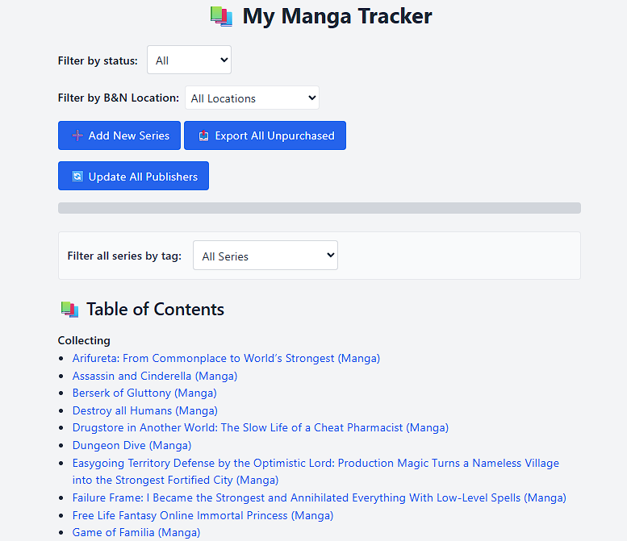
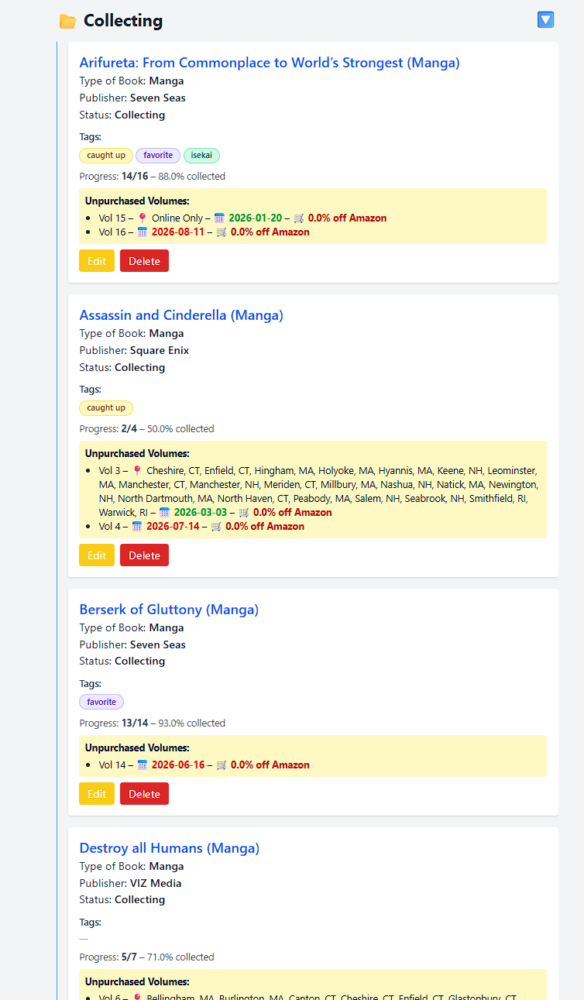
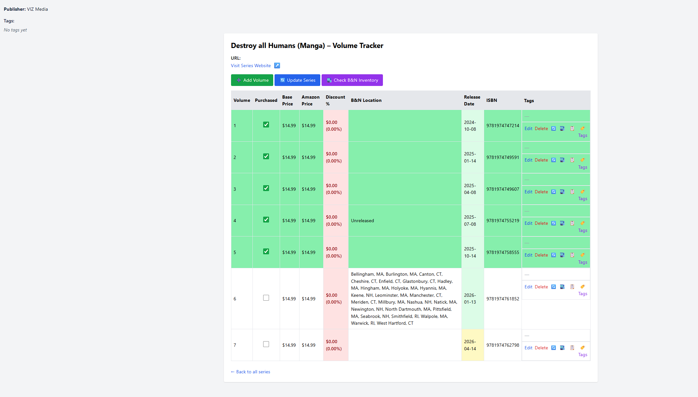

# Manga Tracker







A modular Python automation tool for tracking manga series and volumes using a local SQLite database.  
This project demonstrates practical experience in building data pipelines, scraper automation, schema design, and lightweight web interfaces — all foundational skills for AI automation and AI infrastructure engineering.

---

## 🔧 Purpose

This project started as a personal tool and evolved into a demonstration of:

- Python-based automation
- Modular scraper architecture
- Structured data ingestion pipelines
- Local database schema design and migrations
- Lightweight Flask UI development
- Real-world debugging (HTML changes, selectors, bot protection)

The same engineering principles apply directly to AI workflows: reproducible pipelines, modular components, and reliable data handling.

---

## 🧱 Architecture Overview

- **Python + SQLite** for a simple, reliable local datastore  
- **Generalized publisher scraper** (originally built for Seven Seas, now extended to multiple publishers) using `requests` + `BeautifulSoup`.
- **Barnes & Noble parser** replacing the original scraper after the site increased automation protections.  
- **Schema helpers** and migration scripts for evolving the database  
- **Flask UI** for browsing and interacting with the dataset  
- **Separation of concerns** between scraping, data models, and presentation  
- **Selector tests** to validate scraper behavior

This mirrors the structure of AI data prep pipelines: modular components, predictable transformations, maintainable workflows, and the ability to pivot between scraping and parsing as sites evolve their automation protections.

---

## 📂 Key Components

- `app.py` — Flask interface  
- `models.py` — schema definitions and helpers  
- `db.py` — SQLite utilities  
- `seven_seas/` — shared scraper utilities and helper functions
- `seven_seas_scraper.py` — generalized multi‑publisher scraper using `requests` + `BeautifulSoup`
- `bn_inventory_scraper.py` — legacy Barnes & Noble scraper (superseded by the HTML parser)
- `static/` — placeholder for static assets (currently unused)
- `templates/` — HTML templates for the Flask UI
- `test_*.py` — selector and scraper tests  

The local database (`manga.db`) is intentionally excluded from version control.

---

## ▶️ Running the App (Optional)

This project is primarily a portfolio artifact.  
Running it is optional, but possible:

```bash
python app.py
